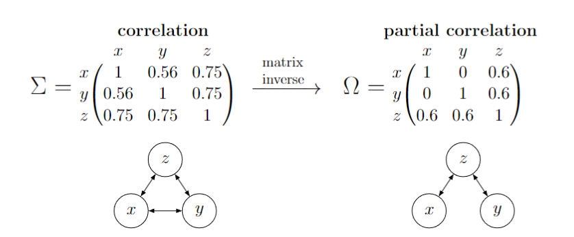

```{r setup, include=FALSE}

knitr::opts_chunk$set(echo = TRUE, dev="png", dpi=96)

library(tidyverse)
library(brms)
library(MCMCglmm)
library(parallel)
library(knitr)
library(geiger)
library(ape)
library(phytools)
library(caper)
library(bayesplot)
library(ggtree)
library(gridExtra)
library(MCMCpack)

source("MR-PMM_tutorial_functions.R")

m.1 <- readRDS("m.1.rds");b.1 <- readRDS("b.1.rds")
m.2 <- readRDS("m.2.rds");b.2 <- readRDS("b.2.rds")
m.3 <- readRDS("m.3.rds");
m.4 <- readRDS("m.4.rds");b.4 <- readRDS("b.4.rds")

```

\

This tutorial is associated with the article "Multi-Response Phylogenetic Mixed Models: Concepts and Application"

https://onlinelibrary.wiley.com/doi/full/10.1111/brv.70001

by

Ben Halliwell, Barbara R. Holland & Luke A. Yates

\

$\color{orange}{\text{N.B. This tutorial is a live document that will continue to be improved and updated by the authors. Enjoy!}}$

\

# Introduction

In this tutorial we demonstrate how to implement multi-response (MR) phylogenetic mixed models (PMM) in two popular R packages, MCMCglmm and brms. We cover both Gaussian and non-Gaussian models, from data simulation, to model specification, fitting, diagnostics, validation and inference.

While frequentist implementations of MR-PMM are available (e.g., ASReml), we advocate for a Bayesian approach due to 1) greater flexibility in fitting non-Gaussian response traits; 2) control gained through specification of prior distributions; 3) suitability for estimating variance components associated with structured random effects; 4) the ability to sample conditional multivariate distributions, avoiding intractable integration problems faced by frequentist techniques.

Throughout this tutorial we explore a low dimensional example (tree with only 5 taxa) in order to show workings of the matrix operations. This is for the sake of exposition only; analyses of the form presented require much larger sample sizes (number of taxa) to reliably estimate model parameters. Therefore results and outputs are instead based on models fit to data simulated for 250 taxa.

\

# Packages

This tutorial makes use of the following packages and their dependencies:

```{r, eval=F}

# packages
library(tidyverse)
library(brms)
library(MCMCglmm)
library(parallel)
library(knitr)
library(geiger)
library(ape)
library(phytools)
library(caper)
library(bayesplot)
library(ggtree)
library(gridExtra)
library(MCMCpack)

# tutorial functions file
source("MR-PMM_tutorial_functions.R")

```

\

# Model 1 - Single-Response Gaussian

\

## Model Explanation

For the case of a single Gaussian trait, our response variable $\mathbf{y}$, a vector of length $N_\mathrm{obs}$, is modeled as a linear combination of fixed $\mathbf{b}$ and random $\mathbf{u}$ effects, and residual errors $\mathbf{e}$

\

\begin{eqnarray}\label{eq_SR_MM}
\mathbf{y} &=& \mathbf{X}\mathbf{b} + \mathbf{Z}\mathbf{u} + \mathbf{e},
\end{eqnarray}

\

where $\mathbf{X}$ and $\mathbf{Z}$ are design matrices for the fixed and random effects, respectively.

We begin with a simple example, in which $\mathbf{b}$ is length 1 and estimates a common intercept for $\mathbf{y}$, and $\mathbf{u}$ is a vector of phylogenetic intercepts equal in length to the number of taxa. In order to capture the expected influence of phylogenetic history on $\mathbf{y}$, (similar values among closely related taxa), our phylogenetic random effect $\mathbf{u}$ is distributed as multivariate normal with mean 0 and (co)variance $\sigma^2_\mathrm{phy}\mathbf{C}$,

\

\begin{eqnarray}
\mathbf{u} &\sim& \mathcal{N}(0, \sigma^2_\mathrm{phy}\mathbf{C}),
\end{eqnarray}\


where $\mathbf{C}$ is a fixed $N_\mathrm{taxa} \times N_\mathrm{taxa}$ phylogenetic correlation matrix and $\sigma^2_\mathrm{phy}$, the phylogenetic variance, is a scalar to be estimated by the model. This model therefore takes as input a phylogeny (topology and branch lengths), which is assumed to be known without error (though in a
Bayesian setting, phylogenetic uncertainty can be incorporated by combining posterior samples across models fit to a set of candidate topologies). The $\mathbf{C}$ matrix is derived from the similarity matrix of the phylogeny, which gives the expected covariance in $\mathbf{y}$ among taxa assuming Brownian motion evolution [@symonds2014primer].

\

\begin{eqnarray}
\mathbf{C} &=& 
\begin{pmatrix}\mathrm{C}_{11} & \mathrm{C}_{12} & \ldots & \mathrm{C}_{1N_\mathrm{taxa}} \\ 
                \mathrm{C}_{21} & \mathrm{C}_{22} & \ldots & \mathrm{C}_{2N_\mathrm{taxa}} \\
                \vdots & \vdots & \ddots & \vdots \\ 
                \mathrm{C}_{N_\mathrm{taxa}1} & \mathrm{C}_{N_\mathrm{taxa}2} & \ldots & \mathrm{C}_{N_\mathrm{taxa}N_\mathrm{taxa}} \\ 
\end{pmatrix}
\end{eqnarray}\

In contrast, the identity matrix $\mathbf{I}$ (an $N_{obs} \times N_{obs}$ matrix with 1 in all diagonal elements and 0 in all off-diagonal elements) encodes independent residual error associated with each observation

\

\begin{eqnarray}
\mathbf{e} \sim \mathcal{N}(0, \sigma^2_\mathrm{res}\mathbf{I})\\
\end{eqnarray}\

\begin{eqnarray}
\mathbf{I} &=& 
\begin{pmatrix}\mathrm{I}_{11} & 0 & \ldots & 0 \\ 
                0 & \mathrm{I}_{22} & \ldots & 0 \\
                \vdots & \vdots & \ddots & \vdots \\ 
                0 & 0 & \ldots & \mathrm{I}_{N_\mathrm{obs}N_\mathrm{obs}} \\ 
\end{pmatrix}
\end{eqnarray}\


\

$\mathbf{EXAMPLE}$

Consider the following 5-taxon phylogeny with similarity between taxa shown on the x axis:

```{r, fig.width=5, fig.align='center'}
# define a tree using Newick notation
toy.phy <- ape::read.tree(text='((5:3, (4:2, 3:2):1):1, (2:1, 1:1):3);')

# plot
plot(toy.phy, label.offset=0.1, edge.width=1.5)
axis(1, at = seq(0,4,by=1), labels = seq(0,4,by=1), line = 0.5)
title(xlab="similarity")
```

For this phylogeny, the similarity matrix (elements expressing the sum of shared branch lengths between two taxa, $i$ and $j$), $\mathbf{C}$, is:

\

\begin{eqnarray}
\mathbf{C} &=& 
\begin{pmatrix}\mathrm{C}_{11} & \mathrm{C}_{12} & \mathrm{C}_{13} & \mathrm{C}_{14} & \mathrm{C}_{15} \\ 
                \mathrm{C}_{21} & \mathrm{C}_{22} & \mathrm{C}_{23} & \mathrm{C}_{24} & \mathrm{C}_{25} \\
                \mathrm{C}_{31} & \mathrm{C}_{32} & \mathrm{C}_{33} & \mathrm{C}_{34} & \mathrm{C}_{35} \\
                \mathrm{C}_{41} & \mathrm{C}_{42} & \mathrm{C}_{43} & \mathrm{C}_{44} & \mathrm{C}_{45} \\
                \mathrm{C}_{51} & \mathrm{C}_{52} & \mathrm{C}_{53} & \mathrm{C}_{54} & \mathrm{C}_{55} \\
                \end{pmatrix}
&=&                
\begin{pmatrix} 4 & 3 & 0 & 0 & 0 \\ 
                3 & 4 & 0 & 0 & 0 \\
                0 & 0 & 4 & 2 & 1 \\
                0 & 0 & 2 & 4 & 1 \\
                0 & 0 & 1 & 1 & 4 \\
                \end{pmatrix}

                
\end{eqnarray}\

In order to facilitate comparison between variance components, $\mathbf{C}$ is standardised to the unit diagonal (i.e., re-scaled to a correlation matrix) prior to analyses, such that,

\

\begin{eqnarray}
\mathbf{C} &=& 
\begin{pmatrix} 1 & 0.75 & 0 & 0 & 0 \\ 
                0.75 & 1 & 0 & 0 & 0 \\
                0 & 0 & 1 & 0.5 & 0.25 \\
                0 & 0 & 0.5 & 1 & 0.25 \\
                0 & 0 & 0.25 & 0.25 & 1 \\
                \end{pmatrix}
\end{eqnarray}\

Assuming a dataset with a single observation per taxon, the identity matrix $\mathbf{I}$ for this model would be

\begin{eqnarray}
\mathbf{I} &=& 
\begin{pmatrix} 1 & 0 & 0 & 0 & 0 \\ 
                0 & 1 & 0 & 0 & 0 \\
                0 & 0 & 1 & 0 & 0 \\
                0 & 0 & 0 & 1 & 0 \\
                0 & 0 & 0 & 0 & 1 \\
                \end{pmatrix}
\end{eqnarray}\

\

## Data Simulation

Implementing such a model in R is fairly straight forward in both MCMCglmm and brms. But first, let's simulate some data to make explicit what we are trying to model. To simulate data under this model, we simply construct our variable, $\mathbf{y}$, from the linear combination of predictors specified by the model, by supplying vectors of length $N_\mathrm{obs}$ for each of the quantities $\mathbf{b}$, $\mathbf{u}$, and $\mathbf{e}$. For Gaussian variables this can be done directly. For non-Gaussian variables, simulation is a two-step process where $\mathbf{u}$ and $\mathbf{e}$ are simulated on the link scale to determine the mean and the response values themselves are subsequently drawn from the appropriate distribution (see section 3). In this example, we will simulate from an intercept only model (i.e., $\mathbf{b}$ = $\mathbf{b}_0$).


```{r eval=T}

## SIMULATE DATA FROM SINGLE RESPONSE PHYLOGENETIC MIXED MODEL

# simulation parameters
reps = 1 # number of observations per taxon
Ntaxa = 250 # number of taxa
Nobs = Ntaxa * reps # number of observations

# simulate coalescent tree
phy <- ape::rcoal(n=Ntaxa)

# create covariance matrix from tree, scale to correlation matrix with corr = T
C = ape::vcv.phylo(phy, corr=T)

# identity matrix
I = diag(Nobs)

# fixed effects (intercept only)
b = 0

# phylogenetic variance
sigma_phy = 1

# residual variance
sigma_res = 0.1

# simulate phylogenetic random effects as one draw from a MVN
u = MASS::mvrnorm(reps,rep(0,Ntaxa),sigma_phy*C)

## for reps >1, re-order u by replicate
if (reps > 1) {
u_stacked <- c()
for (i in 1:reps) {u_stacked[((i*Ntaxa)-(Ntaxa-1)):(i*Ntaxa)] <- u[i,]}
u = u_stacked
}
 
# simulate residuals as one draw from a MVN
e = MASS::mvrnorm(1,rep(0,Nobs),sigma_res*I)

# construct response from the linear predictor
y = b + u + e

# generate data frame
animal <- rep(phy$tip.label,reps) # "animal" is a reserved term in MCMCglmm for taxon ID
d <- data.frame(animal,y)

```

\

We can plot our simulated data against the tree for a visual assessment of phylogenetic structure in the distribution of trait values

```{r, eval=T}
## PLOT USING GGTREE

# convert to tibble and define 'id' column to associate data and tree in geom_facet
y_bar <- tibble(id = d$animal, bar_val = d$y)
# plot
ggtree(phy) + 
  geom_facet(panel = "trait", data = y_bar, geom = geom_col, 
             col = blues9[6], fill = blues9[6], aes(x = bar_val), orientation = 'y', width = 1) + 
  theme(strip.background = element_blank(),strip.text = element_blank())

```


\

## Model Specification

With our tree and trait data simulated, we can now fit the model. The following code chunks fit the same model in two different R packages, `MCMCglmm` and `brms`:


```{r eval=FALSE}

## MCMCglmm 
p.m.1 <- list(G = list(G1 = list(V = 1, nu = 0.002)), 
              R = list(V = 1, nu = 0.002))
m.1 <- MCMCglmm(y ~ 1,
                random   = ~animal,
                pedigree = phy, 
                family   = c("gaussian"), 
                data     = d, 
                prior    = p.m.1,
                nitt     = 110000, 
                burnin   = 10000, 
                thin     = 100,
                pr = T, verbose = F
                )

```


```{r eval=FALSE}

## brms
b.1 <- brm(y ~ 1 + (1|gr(animal, cov = C)), 
           data   = d,
           family = gaussian(), 
           data2  = list(C = C),
           cores  = 4, 
           chains = 4
           )

```

\

## Model Syntax

In MCMCglmm, `animal` is a reserved term used to identify individuals/taxa in a quantitative genetic/phylogenetic analysis. The random effect specification `~animal` instructs MCMCglmm to fit a random effect at the individual/taxon level with covariance structure supplied via the `pedigree` argument. For `pedigree`, MCMCglmm accepts a `phylo` object directly and performs the necessary steps to derive the $\mathbf{C}$ matrix under the hood, while deriving computational gains from efficient use of the tree structure [@hadfield2010]. The remaining arguments specify the data, the priors, and the sampler settings. The argument `pr` is used to retain the posterior distribution of random effects and `verbose=F` suppresses MCMC output to the console.

In brms, the phylogenetic random effect can be encoded in the style of lme4 `(1|gr(animal, cov = C))`, where `(1|x)` specifies random intercepts and `gr(animal, cov = C)` encodes the phylogenetic group structure. 

A key difference between these packages is the Monte Carlo sampling method implemented and the subsequent choice of priors. MCMCglmm is based on Gibbs sampling, which utilises conjugate prior distributions to reduce sampling time through analytic computations.
brms uses Hamiltonian Monte Carlo sampling which is an efficient hybrid of optimisation and sampling approaches that places no restrictions on the choice of prior. It is not necessary (or even recommended) to specify a prior to fit this model in brms because sensible defaults are used automatically.

\

## Convergence Diagnostics

Basic convergence diagnostics are easily obtained for models fit in either package. As a first step, it is advisable to perform visual checks of the MCMC sample trace to confirm adequate mixing and stationary chains.

```{r, eval = F}

# visual check for convergence in MCMC chains
plot(m.1$VCV)
plot(b.1)

```

Another standard indicator of sampling adequacy is the effective sample size (ESS) of each parameter estimate. In the presence of auto-correlation between MCMC samples, the ESS will be reduced relative to the thinned sample number, with low ESS indicating poor sampling. ESS is reported in the model summary for both `MCMCglmm` and `brms`, with a bulk ESS >400 recommended for a positive assessment of convergence [@vehtari2021rank].

```{r, eval = F}

# model summaries
summary(m.1)
b.1

```

As `brms` fits multiple MCMC chains by default, potential scale reduction factors, $\widehat{R}$, are reported in the model summary for a quantitative assessment of convergence for each parameter. As a rule of thumb, $\widehat{R}$ $\\<$ 1.05 indicates adequate convergence [@gelman2013BDA], though more stringent criteria ($\widehat{R}$ $\\<$ 1.01 across 4 MCMC chains) have recently been advocated [@vehtari2021rank]. For `MCMCglmm`, $\widehat{R}$ can be calculated from multiple MCMC chains of the same model using the `Rhat` function from rstan.

```{r, eval = F}

## MCMCglmm Rhat
# calculate Rhat for each variance component over multiple MCMC chains

# fit multiple chains
m.1.2 <- mclapply(1:4, function(i) {
  MCMCglmm(y ~ 1,
           random   = ~animal,
           pedigree = phy, 
           family   = c("gaussian"), 
           data     = d, 
           prior    = p.m.1,
           nitt     = 110000,
           burnin   = 10000, 
           thin     = 100,
           pr = T, verbose = F
           )
}, mc.cores=1)

# extract and combine posterior samples of VCV
m.1.2 <- lapply(m.1.2, function(m) m$VCV)
m.1.2 <- do.call(mcmc.list, m.1.2)
# plot(m.1.2) # overlay chains

# units (residual) term
units <- lapply(m.1.2, "[", , "units")
units <-  tibble("c1" = units[[1]],"c2" = units[[2]],
                 "c3" = units[[3]],"c4" = units[[4]])
units %>% as.matrix %>% Rhat

# animal (phylogenetic) term
animal <- lapply(m.1.2, "[", , "animal")
animal <-  tibble("c1" = animal[[1]],"c2" = animal[[2]],
                  "c3" = animal[[3]],"c4" = animal[[4]])
animal %>% as.matrix %>% Rhat

```

\

## Model Validation

Having satisfied convergence diagnostics, the next step is to evaluate model performance through validation procedures such as posterior predictive checks. Posterior predictive checks simulate data under the fitted model, then compare these replicated data sets (or appropriate summary statistics) to the observed data to identify any systematic discrepancies (@gelman2006data, p. 158). It is very straightforward to run posterior predictive checks in `brms`.

```{r, eval = F}

# brms - posterior predictive checks
b.1 %>% pp_check(ndraws = 100)

```

\

For `MCMCglmm`, posterior predictive checks for this simple model can be obtained directly with the following.

```{r, eval = F}

# MCMCglmm - posterior predictive checks
rep <- 100 # number of draws
pred <- matrix(nrow = rep, ncol = Ntaxa) # ncol = number of taxa

# draw random normals based on parameters of the fitted model
for (i in 1:rep) {
pred[i,] <- rnorm(Nobs, 
                  (m.1$X %*% m.1$Sol[i,])@x,
                  sqrt(sum(m.1$VCV[i,])))
}

# perform posterior predictive checks
obs <- d$y
pp_check(obs, pred, ppc_dens_overlay)


```

However, posterior predictive checks for MR models require additional care to properly account for trait covariances on different levels in the model hierarchy (See Model 2, also see [@hadfield2010] and `MCMCglmm` course notes).

An even more rigorous approach to model validation of MR-PMM is leave-one-out (LOO) cross-validation (CV) (@roberts2017cross; also see Tutorial 2 covering an example MR-PMM analysis on leaf traits in Eucalyptus (https://benjamin-halliwell.github.io/MR-PMM/MR-PMM_euc_example_analysis.html), and Section 4 on Prediction in manuscript). Cross validation is the use of data splitting to estimate the predictive performance of one or more statistical models, usually for the purpose of model comparison and selection. However, predictive assessment tools such as cross validation are also useful to quantify or simply visualise how well a model can predict to new data (out of sample performance), e.g., to new taxon-trait pairs in a PMM. This is distinct from the assessment of model adequacy which concerns prediction of data to which a model was fit (within sample performance).

\

## Inference

Having fit and validated our model, the next step is to make inferences on the parameters estimated. In the Bayesian paradigm, inference is based on the estimated posterior distribution of the model parameters. For example, one-sided hypothesis tests can easily be performed by computing the proportion of samples satisfying a specified condition (pMCMC), e.g., $\theta < 0$. Inference can also be made by directly interpreting summary statistics of the marginal posterior distribution (e.g., the median and the 50% and 95% credible intervals). This is easily evaluated from the model summary. However, we note that, while intercept estimates are directly comparable, MCMCglmm reports variance components where-as brms reports these quantities as standard deviations. As our simulations also specify variances, we will transform estimates from brms by calculating quantiles from the square of MCMC samples.

```{r, eval = F}
# summary
summary(m.1)
summary(b.1)

# intercept
summary(m.1)$solutions
summary(b.1)[["fixed"]]

# phylogenetic variance (sigma_phy)
m.1$VCV[,"animal"] %>% quantile(probs=c(0.025,0.5,0.975))
b.1 %>% as_tibble() %>% 
  pull(sd_animal__Intercept) %>% .^2 %>% 
  as.mcmc %>% quantile(probs=c(0.025,0.5,0.975))

# residual variance (sigma_res)
m.1$VCV[,"units"] %>% quantile(probs=c(0.025,0.5,0.975))
b.1 %>% as_tibble() %>% 
  pull(sigma) %>% .^2 %>% 
  as.mcmc %>% quantile(probs=c(0.025,0.5,0.975))

```

\

### Phylogenetic Signal

For our simple example, an estimate of phylogenetic signal $\lambda$ (the proportion of variation in a trait attributed to phylogenetic effects) in $\mathbf{y}$ can be calculated as

\begin{eqnarray} \label{eq_lambda}
\lambda = \sigma^2_\mathrm{phy}/(\sigma^2_\mathrm{phy}+\sigma^2_\mathrm{res})
\end{eqnarray}\

Since we have joint posterior samples for all model parameters, we can derive summaries of the posterior distribution of $\lambda$ as follows:

```{r, eval = F}

# MCMCglmm
(m.1$VCV[,"animal"]/(m.1$VCV[,"animal"]+m.1$VCV[,"units"])) %>% 
  quantile(probs=c(0.025,0.5,0.975))

# brms
b.1 %>% as_tibble() %>% 
        dplyr::select(sigma_phy = sd_animal__Intercept, sigma_res = sigma) %>% 
        mutate(lambda = sigma_phy^2/(sigma_phy^2 + sigma_res^2)) %>% 
        pull(lambda) %>% quantile(probs=c(0.025,0.5,0.975))

```

We can also confirm that $\lambda$ from our PMM is estimating the same quantity as the MLE of $\lambda$ from an equivalent pgls model.

```{r, eval = F}

## compare to MLE of lambda from PGLS
comp_dat <- caper::comparative.data(phy, d, animal, vcv=TRUE)
mod <- caper::pgls(y ~ 1, data = comp_dat, lambda = "ML")
summary(mod)$param["lambda"]

```

\

# Model 2 - Multi-Response Gaussian

\

## Model Explanation

For multi-response (MR) models, species traits are modeled jointly as responses, allowing trait (co)variances to be partitioned across different levels in the model hierarchy. An MR-PMM with two Gaussian response variables $\mathbf{y}_1$ and $\mathbf{y}_2$ takes the form,

```{=tex}
\begin{eqnarray} \label{eq_MR_PMM_2}
\mathbf{y} = 
\begin{pmatrix}\mathbf{y}_1 \\
\mathbf{y}_2\end{pmatrix} &=& 
\begin{pmatrix}\mathbf{X}_1\mathbf{b}_1 + \mathbf{Z}_1\mathbf{u}_1 + \mathbf{e}_1 \\
               \mathbf{X}_2\mathbf{b}_2 + \mathbf{Z}_2\mathbf{u}_2 + \mathbf{e}_2 
\end{pmatrix}
\end{eqnarray}
```
\
With this design, the phylogenetic random effects and residuals are drawn jointly from multivariate normal distributions, with variance given by the Kronecker product of a trait-level correlation matrix and group-level variance structures $\mathbf{C}$ and $\mathbf{I}$, respectively

<!-- as multivariate normals, with variance given by the Kronecker product of a trait-level covariance matrix $\Sigma^{\mathrm{b}}$ and the fixed phylogenetic covariance matrix, $\mathbf{C}$. With $m$ traits (response variables), $\Sigma^{\mathrm{b}}$ is m x m and specifies the phylogenetic variance in each trait (diagonals) as well as the phylogenetic covariance between traits (off-diagonals). With $n$ taxa in the phylogeny, $\Sigma^{\mathrm{b}} \otimes C$ is an $mn\times mn$ cross-covariance matrix containing phylogenetic (co)variances for all traits as well as between all traits. Thus, the phylogenetic random effects and independent residuals are drawn -->
\
\begin{eqnarray}
\mathbf{u} = (\mathbf{u}_1, \mathbf{u}_2)^\mathrm{T} &\sim& \mathrm{N}(0, \boldsymbol{\Sigma}^{\mathrm{phy}} \otimes \mathbf{C}) \\ \nonumber
\mathbf{e} = (\mathbf{e}_1, \mathbf{e}_2)^\mathrm{T} &\sim& \mathrm{N}(0, \boldsymbol{\Sigma}^{\mathrm{res}} \otimes \mathbf{I}_{N_{\mathrm{obs}}})
\end{eqnarray}
\
<!-- \\ -->
<!-- \Sigma &=& \Sigma^{\mathrm{b}} \otimes C + \Sigma^{\mathrm{e}} \otimes I -->

<!-- Notice that the two taxon-level variance structures we encountered in the univariate case above ($\mathbf{C}$ and $\mathbf{I}$) remain, but we must now also consider trait-level covariance (i.e., the tendency for response traits to covary) operating at both the phylogenetic and independent level. This is achieved via the Kronecker operation $\otimes$ (see matrix expansions below).  -->

For example, the phylogenetic trait-level correlation matrix $\Sigma^{\mathrm{phy}}$ is $m\times m$, where $m$ is the number of response traits in the model,

\

\begin{eqnarray}
\boldsymbol{\Sigma}^{\mathrm{phy}}
= 
\begin{pmatrix}\Sigma^{\mathrm{phy}}_{11} & \Sigma^{\mathrm{phy}}_{12} & \ldots & \Sigma^{\mathrm{phy}}_{1m} \\ 
                \Sigma^{\mathrm{phy}}_{21} & \Sigma^{\mathrm{phy}}_{22} & \ldots & \Sigma^{\mathrm{phy}}_{2m} \\
                \vdots & \vdots & \ddots & \vdots \\ 
                \Sigma^{\mathrm{phy}}_{m1} & \Sigma^{\mathrm{phy}}_{m2} & \ldots & \Sigma^{\mathrm{phy}}_{mm} \\ \end{pmatrix}
&=& 
\begin{pmatrix}(\sigma^{\mathrm{{phy}}}_1)^2 &
                \sigma^{\mathrm{{phy}}}_1\sigma^{\mathrm{{phy}}}_2\rho^{\mathrm{{phy}}}_{12} & 
                \ldots & 
                \sigma^{\mathrm{{phy}}}_1\sigma^{\mathrm{{phy}}}_m\rho^{\mathrm{{phy}}}_{1m} \\ 
                \sigma^{\mathrm{{phy}}}_2\sigma^{\mathrm{{phy}}}_1\rho^{\mathrm{{phy}}}_{21} & 
                (\sigma^{\mathrm{phy}}_2)^2 & 
                \ldots & 
                \sigma^{\mathrm{{phy}}}_2\sigma^{\mathrm{{phy}}}_m\rho^{\mathrm{{phy}}}_{2m} \\
                \vdots & \vdots & \ddots & \vdots \\ 
                \sigma^{\mathrm{{phy}}}_m\sigma^{\mathrm{{phy}}}_1\rho^{\mathrm{{phy}}}_{m1} & 
                \sigma^{\mathrm{{phy}}}_m\sigma^{\mathrm{{phy}}}_2\rho^{\mathrm{{phy}}}_{m2} &
                \ldots & 
                (\sigma^{\mathrm{phy}}_m)^2 \\ \end{pmatrix}\\[2mm]

\end{eqnarray}\

such that elements of $\Sigma^{\mathrm{phy}}$ have the general form,

\

```{=tex}
\begin{eqnarray}
\Sigma^{\mathrm{{phy}}}_{ij} = \sigma^{\mathrm{{phy}}}_i\sigma^{\mathrm{{phy}}}_j\rho^{\mathrm{{phy}}}_{ij} \\
\end{eqnarray}
```
\

where $\rho^{\mathrm{{phy}}}_{ij}$ is the phylogenetic correlation between traits $i$ and $j$ and $\sigma^{\mathrm{{phy}}}_i$ is the standard deviation of the phylogenetic component of variation in trait $i$. 

Returning to our 5-taxon example, a MR model with two Gaussian response traits (i.e., $m = 2$) will have covariance matrix for the phylogenetic random effects, $\boldsymbol{\Sigma}^{\mathrm{phy}} \otimes \mathbf{C}$, of the form:

\

\begin{eqnarray}

\boldsymbol{\Sigma}^{\mathrm{phy}} \otimes \mathbf{C}
&=& 
\begin{pmatrix} \Sigma^{\mathrm{phy}}_{11}\mathbf{C} & \Sigma^{\mathrm{phy}}_{12}\mathbf{C}  \\ 
                \Sigma^{\mathrm{phy}}_{21}\mathbf{C} & \Sigma^{\mathrm{phy}}_{22}\mathbf{C}  \\
\end{pmatrix}
&=&
\begin{pmatrix} \Sigma^{\mathrm{phy}}_{11}
                \left(\begin{smallmatrix} 
                4 & 3 & 0 & 0 & 0 \\ 
                3 & 4 & 0 & 0 & 0 \\
                0 & 0 & 4 & 2 & 1 \\
                0 & 0 & 2 & 4 & 1 \\
                0 & 0 & 1 & 1 & 4 \\
                \end{smallmatrix}\right) &
                \Sigma^{\mathrm{phy}}_{12}
                \left(\begin{smallmatrix} 
                4 & 3 & 0 & 0 & 0 \\ 
                3 & 4 & 0 & 0 & 0 \\
                0 & 0 & 4 & 2 & 1 \\
                0 & 0 & 2 & 4 & 1 \\
                0 & 0 & 1 & 1 & 4 \\
                \end{smallmatrix}\right) \\
                \Sigma^{\mathrm{phy}}_{21}
                \left(\begin{smallmatrix} 
                4 & 3 & 0 & 0 & 0 \\ 
                3 & 4 & 0 & 0 & 0 \\
                0 & 0 & 4 & 2 & 1 \\
                0 & 0 & 2 & 4 & 1 \\
                0 & 0 & 1 & 1 & 4 \\
                \end{smallmatrix}\right) &
                \Sigma^{\mathrm{phy}}_{22}
                \left(\begin{smallmatrix} 
                4 & 3 & 0 & 0 & 0 \\ 
                3 & 4 & 0 & 0 & 0 \\
                0 & 0 & 4 & 2 & 1 \\
                0 & 0 & 2 & 4 & 1 \\
                0 & 0 & 1 & 1 & 4 \\
                \end{smallmatrix}\right)\\
\end{pmatrix}

\end{eqnarray}\

\

Similarly, the covariance matrix for the independent residual errors, $\boldsymbol{\Sigma}^{\mathrm{res}} \otimes \mathbf{I}$, is:

\


\begin{eqnarray}

\boldsymbol{\Sigma}^{\mathrm{res}} \otimes \mathbf{I}
&=& 
\begin{pmatrix} \Sigma^{\mathrm{res}}_{11}\mathbf{I} & \Sigma^{\mathrm{res}}_{12}\mathbf{I}  \\ 
                \Sigma^{\mathrm{res}}_{21}\mathbf{I} & \Sigma^{\mathrm{res}}_{22}\mathbf{I}  \\
\end{pmatrix}
&=&
\begin{pmatrix} \Sigma^{\mathrm{res}}_{11}
                \left(\begin{smallmatrix} 
                1 & 0 & 0 & 0 & 0 \\ 
                0 & 1 & 0 & 0 & 0 \\
                0 & 0 & 1 & 0 & 0 \\
                0 & 0 & 0 & 1 & 0 \\
                0 & 0 & 0 & 0 & 1 \\
                \end{smallmatrix}\right) &
                \Sigma^{\mathrm{res}}_{12}
                \left(\begin{smallmatrix} 
                1 & 0 & 0 & 0 & 0 \\ 
                0 & 1 & 0 & 0 & 0 \\
                0 & 0 & 1 & 0 & 0 \\
                0 & 0 & 0 & 1 & 0 \\
                0 & 0 & 0 & 0 & 1 \\
                \end{smallmatrix}\right)\\
                \Sigma^{\mathrm{res}}_{21}
                \left(\begin{smallmatrix} 
                1 & 0 & 0 & 0 & 0 \\ 
                0 & 1 & 0 & 0 & 0 \\
                0 & 0 & 1 & 0 & 0 \\
                0 & 0 & 0 & 1 & 0 \\
                0 & 0 & 0 & 0 & 1 \\
                \end{smallmatrix}\right)&
                \Sigma^{\mathrm{res}}_{22}
                \left(\begin{smallmatrix} 
                1 & 0 & 0 & 0 & 0 \\ 
                0 & 1 & 0 & 0 & 0 \\
                0 & 0 & 1 & 0 & 0 \\
                0 & 0 & 0 & 1 & 0 \\
                0 & 0 & 0 & 0 & 1 \\
                \end{smallmatrix}\right)\\
\end{pmatrix}

\end{eqnarray}\

**N.B. This example is purely for illustrative purposes. The parameters of this model are not estimable with such low replication ($\mathbf{N_{taxa}}$ = 5).** Low dimensional $\mathbf{C}$ and $\mathbf{I}$ are used here simply to show matrix operations.

\

## Data Simulation

To simulate covariance between response variables within both the phylogenetic and residual variance components, we specify (co)variance structures for our random effects and independent errors.

```{r eval=FALSE}

## SIMULATE FROM MR-PMM

# number of traits
m = 2

# fixed effects (intercepts for each trait)
b = c(0,0)

# construct the phylogenetic trait-level covariance matrix, Sigma_b
sig.phy <- c(phy11 = 1, phy22 = 1) # sqrt of phylogenetic variances; set to 1 so sigma = sigma^2
cor.phy.12 = 0.5 # phylogenetic correlation between traits 1 and 2
phycor <- matrix(c(c(1,cor.phy.12), c(cor.phy.12,1)),m,m, byrow = T) # phylogenetic correlation matrix
Sigma_phy <- matrix(kronecker(sig.phy, sig.phy),m,m)*phycor # construct Sigma_phy as point-wise product

# N.B. Kronecker used here for ease of matrix formatting. Do not confuse with Kronecker operation 
# used for generating the cross-covariance matrices,e.g., kronecker(Sigma_phy,C). 

# construct the independent trait-level covariance matrix, Sigma_res
sig.res <- c(res11 = 1, res22 = 1) # sqrt of independent variance for each trait
cor.res.12 = 0.5 # independent correlation
rescor <- matrix(c(c(1,cor.res.12),c(cor.res.12,1)),m,m, byrow = T)  # independent correlation matrix
Sigma_res <- matrix(kronecker(sig.res, sig.res),m,m)*rescor # Construct Sigma_res as point-wise product

## simulate phylogenetic random effects
# n = 1 to generate 1 random effect per taxon, mu = rep(0,Ntaxa*m) centers random effects for all 
# taxa on zero, Sigma = kronecker(Sigma_phy,C) defines cross-covariance matrix of random effects.
u = mvrnorm(n = 1, mu = rep(0,Ntaxa*m), Sigma = kronecker(Sigma_phy,C))
# extract for each trait from the vector, b.
u1 <- u[1:Ntaxa] # effects 1:n relate to trait 1
u2 <- u[(1:Ntaxa) + Ntaxa] # effects (1:n)+n relate to trait 2

## simulate errors and extract
# In the kronecker, (phylogeny) independent trait-level covariance captured by Sigma_res, 
# observation-level independent error captured by I.
e = mvrnorm(1,rep(0,Nobs*m),kronecker(Sigma_res,I))
e1 <- e[1:Nobs]
e2 <- e[(1:Nobs) + Nobs]

# construct response traits from each linear predictor
y1 = b[1] + u1 + e1
y2 = b[2] + u2 + e2

# generate data frame
animal <- phy$tip.label
d2 <- data.frame(animal,y1,y2)
d2$obs <- 1:nrow(d2)

```

\

## Priors

The classical parameterisation for the multivariate normal is the covariance form, for which the conjugate prior is the inverse Wishart distribution, characterised by a target matrix (V) and degree of belief parameter (nu). Conjugate priors are an algebraically convenient choice because they provide analytic solutions for certain steps of the model fitting which can greatly reduce estimation time in a Gibbs sampling approach (the covariance form with inverse Wishart prior is implemented in `MCMCglmm`). A shortcoming of specifying priors for the covariance matrix is that the variances and correlations are not treated independently. Indeed, while the inverse Wishart prior with degrees of freedom equal to the number of response traits (or marginally greater) is a weakly informative prior for variance components, its marginal prior for correlations concentrates probability mass away from zero, potentially inflating false positive rates.

```{r, eval=FALSE}

# set up simulation parameters
n_samples <- 100000
k <- 2 # number of response variables
nu_values <- c(k, k+1, k+2, k+10) # different prior settings for nu

# scale matrix (identity)
V <- diag(k)

# simulate correlations and variances for different nu values
correlations <- list()
vars <- list()

for (nu in nu_values) {
  samples <- replicate(n_samples, MCMCpack::riwish(nu, V), simplify = FALSE)
  cor_vals <- sapply(samples, function(m) m[1, 2] / sqrt(m[1, 1] * m[2, 2]))
  var_vals <- sapply(samples, function(m) m[1, 1])
  correlations[[as.character(nu)]] <- cor_vals
  vars[[as.character(nu)]] <- var_vals
}

# convert to long format for ggplot
df <- data.frame(
  nu = rep(nu_values, each = n_samples),
  correlation = unlist(correlations),
  var = unlist(vars)
)
df$nu <- factor(df$nu, levels = nu_values)

# plot histogram of correlations
p1 <- ggplot(df, aes(x = correlation, fill = nu, color = nu)) +
  geom_histogram(alpha = 0.3, bins = 50, position = "identity") +
  facet_wrap(~nu) +
  labs(
    title = paste0("Density of Correlation Coefficients (IW) K = ", k),
    x = "Correlation",
    fill = "Degrees of\nFreedom (nu)",
    color = "Degrees of\nFreedom (nu)"
  ) +
  theme_minimal() +
  theme(panel.grid.major = element_blank(),
        panel.grid.minor = element_blank(),
        plot.title = element_text(hjust = 0.5),
        strip.text.x = element_blank()) +
  coord_cartesian(xlim = c(-1, 1))
p1

# calculate and print summary statistics
# note that the probability of |correlation| > 0.5 ≅ 0.5 (i.e., is uniform) when nu = k+1
summary_stats <- df %>%
  group_by(nu) %>%
  summarise(
    Mean = mean(correlation),
    SD = sd(correlation),
    Q1 = quantile(correlation, 0.25),
    Median = median(correlation),
    Q3 = quantile(correlation, 0.75),
    P_extreme = mean(abs(correlation) > 0.5)
  )
summary_stats

```


```{r, echo=FALSE, out.width = '80%'}


```

As our focus is on estimating correlations, we proceed with a prior for which nu = k+1.

\

## Model Specification

A MR-PMM with two Gaussian response traits can be specified in MCMCglmm and brms as follows:

```{r eval=FALSE}

## MCMCglmm 
p.m.2 <- list(G = list(G1 = list(V = diag(2), nu = 3)), 
              R = list(R1 = list(V = diag(2), nu = 3)))
m.2 <- MCMCglmm(cbind(y1, y2) ~ trait-1,
                random   = ~us(trait):animal,
                rcov     = ~us(trait):units,
                pedigree = phy,
                family   = c("gaussian","gaussian"), 
                data     = d2, 
                prior    = p.m.2, 
                nitt     = 110000, 
                burnin   = 10000, 
                thin     = 100,
                pr = T, verbose = F
                )
```

```{r eval=FALSE}
## brms
b.2.bf <- brmsformula(mvbind(y1, y2) ~ (1|u|gr(animal, cov = C))) + set_rescor(TRUE)
b.2 <- brm(b.2.bf,
           data   = d2,
           family = gaussian(), 
           data2  = list(C = C),
           cores  = 4, 
           chains = 4
           )


```

\

## Model Syntax

In MCMCglmm, we use `cbind()` to specify multiple response variables. The reserved term `trait` is used to specify fixed effects for all response variables. In our example, `trait-1` suppresses the global intercept, instead fitting separate intercepts for each trait $\mathbf{y}_1$ and $\mathbf{y}_2$. With multiple response variables, it is now possible to model covariance between responses at different levels in the model hierarchy. MCMCglmm offers several options for defining the structure of covariance matrices to be estimated (@hadfield2010; also see MCMCglmm course notes). The argument `~us(trait)` specifies an unstructured (all elements estimated) covariance matrix with dimension equal to the number of response traits (here 2 x 2). The suffix `:animal` specifies this covariance matrix is on the level of the grouping factor `animal`, where-as `:units` encodes the residual covariance matrix.

In brms, we use `mvbind()` to specify multiple response variables. An index (here `|u|`, but any unique identifier is accepted) is used within the random effect specification to instruct brms to estimate the correlation between $\mathbf{y}_1$ and $\mathbf{y}_2$ at the animal group level. Correlation between $\mathbf{y}_1$ and $\mathbf{y}_2$ on the residual level is specified by `set_rescor(TRUE)`. An even more flexible syntax for specifying MR models in `brms` is to define separate formulae for each response variable, allowing for distinct fixed and random predictors, as well as error distributions (See Model 3), for each response variable.

```{r eval=FALSE}

# equivalent to above
b.2_y1 <- brmsformula(y1 ~ 1 + (1|u|gr(animal, cov = C))) + gaussian()
b.2_y2 <- brmsformula(y2 ~ 1 + (1|u|gr(animal, cov = C))) + gaussian()
b.2 <- brm(b.2_y1 + b.2_y2 + set_rescor(TRUE),
           data   = d2,
           family = gaussian(), 
           data2  = list(C = C),
           cores  = 4, 
           chains = 4
           )

```

\

## Inference

### Correlations

For MR cases, the parameters of interest are usually the trait-level correlation coefficients, which are derived by substituting relevant elements into,

\begin{eqnarray} \label{eq_cor_PMM}
\rho^{\cdots}_{12} = \frac{\Sigma^{\cdots}_{12}}{\sqrt{(\Sigma^{\cdots}_{11} \times \Sigma^{\cdots}_{22})}}
\end{eqnarray}\

where $\cdots$ specifies the relevant variance component, e.g., for our simple example, either $\mathrm{phy}$ or $\mathrm{res}$. Thus, posterior distributions of each pairwise correlation estimate are obtained by supplying vectors of posterior samples for each (co)variance parameter. These calculations are performed and reported by default in the brms model summary. For MCMCglmm, correlations can be calculated from (co)variance estimates with some basic manipulations:

```{r eval=FALSE}

## brms
# phylogenetic correlation = cor(y1_Intercept,y2_Intercept)
# independent correlation = rescor(y1,y2)
summary(b.2)

## MCMCglmm
# phylogenetic correlation between y1 and y2
quantile(m.2$VCV[,"traity1:traity2.animal"]/
     sqrt(m.2$VCV[,"traity1:traity1.animal"]*m.2$VCV[,"traity2:traity2.animal"]))
# independent correlation between y1 and y2
quantile(m.2$VCV[,"traity1:traity2.units"]/
     sqrt(m.2$VCV[,"traity1:traity1.units"]*m.2$VCV[,"traity2:traity2.units"]))

```

\

### Phylogenetic Signal

Phylogenetic signal is calculated for each trait by substituting elements of the parameterized (co)variance matrices $\boldsymbol{\Sigma}^{\mathrm{phy}}$ and $\boldsymbol{\Sigma}^{\mathrm{res}}$ into the calculation of $\lambda$, e.g., for $\mathbf{y}_1$:

```{r, eval = F}

# MCMCglmm
quantile(m.2$VCV[,"traity1:traity1.animal"]/
(m.2$VCV[,"traity1:traity1.animal"]+m.2$VCV[,"traity1:traity1.units"]))

# brms
b.2 %>% as_tibble() %>% 
        dplyr::select(sigma_phy_y1 = sd_animal__y1_Intercept, sigma_res_y1 = sigma_y1) %>% 
        mutate(lambda_y1 = sigma_phy_y1^2/(sigma_phy_y1^2 + sigma_res_y1^2)) %>% 
        pull(lambda_y1) %>% quantile(probs=c(0,0.25,0.5,0.75,1))

```

\

### Partial Correlations

The fitted covariance matrices $\boldsymbol{\Sigma}^{\mathrm{phy}}$ and $\boldsymbol{\Sigma}^{\mathrm{res}}$ may be used to compute conditional dependencies (i.e., partial correlations) between traits on both the phylogenetic and residual level. Partial correlations describe the pairwise relationship between response variables conditional on all other response variables in the model (analogous to the partial regression coefficients estimated in multiple regression), and in MR-PMM are derived from elements of the inverse trait-covariance matrices, called precision matrices $\boldsymbol\Omega = \left(\Omega_{ij}\right)$; that is,

\begin{eqnarray}
 \boldsymbol\Omega^{\mathrm{phy}} = (\boldsymbol\Sigma^{\mathrm{phy}})^{-1}
\qquad\quad\mbox{and}\qquad\quad
\boldsymbol\Omega^{\mathrm{res}} = (\boldsymbol\Sigma^{\mathrm{res}})^{-1},
\end{eqnarray}

for which the corresponding partial correlation coefficients are ${-\Omega_{ij}}/{\sqrt{\Omega_{ii}\Omega_{jj}}}$.

For a bivariate model, standard and partial correlation estimates are identical because there are no additional response variables to control for when estimating $\rho^{\mathrm{phy}}_{12}$. However, for models with >2 response variables, standard and partial correlation estimates may vary drastically (see Figure 1 from the [manuscript](https://doi.org/10.1101/2022.12.13.520338) below).

```{r, echo=FALSE, out.width = '80%'}



```

\

To demonstrate, we will simulate data under a trivariate MR-PMM in which the correlation between two variables $x$ and $y$ can be explained entirely by independent causal relationships with a third variable $z$. For brevity, we will simulate data using a wrapper function `mrpmm_sim()` for the procedure outline above.


```{r}

## SIMULATE DATA
m = 3 # number of traits

# define Sigma_b for m = 3 traits (weak evidence that the correlation between x and y (bxy) is causal)
sig.phy <- c(phyxx = 1, phyyy = 1, phyzz = 1) # sqrt of phylogenetic variance for each trait
cor.phy <- c(phyxy = 0.56, phyxz = 0.75, phyyz = 0.75) # phylogenetic correlations
phycor <- matrix(c(c(sig.phy[1],cor.phy[1],cor.phy[2]), # phylogenetic correlation matrix
                 c(cor.phy[1],sig.phy[2],cor.phy[3]),
                 c(cor.phy[2],cor.phy[3],sig.phy[3])),
               m,m, byrow = T) 
Sigma_phy <- matrix(kronecker(sig.phy, sig.phy),m,m)*phycor # construct Sigma_b as point-wise product

# define Sigma_e for m = 3 traits (weak evidence that exy is causal)
sig.res <- c(resxx = 1, resyy = 1, reszz = 1) # sqrt of phylogenetic variance for each trait
cor.res <- c(resxy = 0.56, resxz = 0.75, resyz = 0.75) # phylogenetic correlations
rescor <- matrix(c(c(sig.res[1],cor.res[1],cor.res[2]), # phylogenetic correlation matrix
                 c(cor.res[1],sig.res[2],cor.res[3]),
                 c(cor.res[2],cor.res[3],sig.res[3])),
               m,m, byrow = T) 
Sigma_res <- matrix(kronecker(sig.res, sig.res),m,m)*rescor # construct Sigma_b as point-wise product

# simulate data from MR-PMM
phy3 <- geiger::sim.bdtree(stop = "taxa", n = Ntaxa) # more realistic tree structure
d3 <- mrpmm_sim(n = Ntaxa, m = 3, Sigma_phy, Sigma_res, phy3)
names(d3)[2:4] <- c("x","y","z")

```

\

we can then fit MR-PMM,

```{r, eval = F}
## FIT MODEL
p.m.3 <- list(G = list(G1 = list(V = diag(3), nu = 2.002, 
                                 alpha.mu = rep(0,3), alpha.V = diag(3))), # parameter expanded prior
              R = list(R1 = list(V = diag(3), nu = 2.002)))
m.3 <- MCMCglmm(cbind(x, y, z) ~ trait-1,
                random   = ~us(trait):animal,
                rcov     = ~us(trait):units,
                pedigree = phy3,
                family   = c("gaussian","gaussian","gaussian"), 
                data     = d3, 
                prior    = p.m.3, 
                nitt     = 11000, 
                burnin   = 1000, 
                thin     = 10,
                pr = T, verbose = F
                )

```

\

calculate standard and partial correlation estimates,

```{r, message=F, warning=F}

## CALCULATE CORRELATIONS
mod <- m.3 # dummy model object
vcv <- m.3$VCV # combine posteriors of vcv

# number of response variables in model
n_resp <- str_count(as.character(mod$Fixed$formula[2]), '\\w+')-1

# calculate standard and partial correlations using custom function
cor <- level_cor_vcv(vcv, n_resp, part.1 = "animal", part.2 =  "units")

# result data frame
cor_post <- cor$posteriors %>% bind_rows() %>% as.matrix() %>% as_tibble() %>% 
  mutate(level = rep(c("phylogenetic","residual"), each = nrow(vcv)*2),
         type = rep(c("standard","partial","standard","partial"), each = nrow(vcv))) %>%
  rename(xy = `y:x`, zx = `z:x`, zy = `z:y`) %>% 
  pivot_longer(cols = 1:3, names_to = c("correlation"), values_to = "estimate")

# summarise posteriors
cor_post_sum <- cor_post %>% group_by(level, type, correlation) %>% 
  summarise(mean = mean(estimate),
            ll   = HPDinterval(as.mcmc(estimate), prob=0.95)[1],
            l    = HPDinterval(as.mcmc(estimate), prob=0.5)[1],
            u    = HPDinterval(as.mcmc(estimate), prob=0.5)[2],
            uu   = HPDinterval(as.mcmc(estimate), prob=0.95)[2])

```

\

and plot.

```{r, message=F}

## PLOT
cor_post_sum %>% 
  ggplot(aes(x = mean, y = correlation, col = interaction(type, level))) +
  geom_vline(xintercept = 0, col = "grey25", lty = "dashed") +
  geom_linerange(aes(xmin = ll, xmax = uu, col = interaction(type, level)), 
                 alpha = 0.5, linewidth = 0.75, position = position_dodge2(width=0.5)) +
  geom_linerange(aes(xmin = l, xmax = u), alpha = 1, linewidth = 1.25, 
                 position = position_dodge2(width=0.5)) +
  geom_point(position = position_dodge2(width=0.5), size = 2.5) +
  xlab("correlation estimate") + ylab("") +
  scale_x_continuous(limits = c(-1,1)) +
  scale_color_manual(values=c(blues9[9], blues9[5],"red","pink")) +
  theme_classic() +
  theme(axis.title.y = element_blank(),axis.title.x = element_text(size=12),
    axis.text.x = element_text(size=10),axis.text.y = element_text(size=12),
    axis.ticks.y = element_blank(),
    legend.text = element_text(size = 10),legend.title = element_text(size = 12),
    plot.subtitle = element_text(hjust=0.5, face="bold", color="black"))

```


\

# Model 3 - Multi-Response Non-Gaussian (Gaussian, Bernoulli)

\

## Model Explanation

In previous simulations, we saw that Gaussian responses can be drawn directly from the multivariate structure, i.e., modeled via the identity link function. For non-Gaussian variables, (co)variances must be modeled on the link scale. For example, for Poisson regression the mean is modeled with the log link while for binomial data, the probability of success is modeled with the logit link. To demonstrate, we again simulate and fit data under a bivariate model, this time taking a binomial response for $\mathbf{y_2}$.

\


\begin{eqnarray}
\begin{pmatrix}\mathbf{y_1} \\ \mathrm{logit}(\mathbf{p_2}) \end{pmatrix} &=& 
\begin{pmatrix}\mathbf{X}_1\mathbf{b}_1 + \mathbf{Z}_1\mathbf{u}_1 + \mathbf{e}_1 \\
               \mathbf{X}_2\mathbf{b}_2 + \mathbf{Z}_2\mathbf{u}_2 + \mathbf{e}_2 
\end{pmatrix}\\[2mm]
\\

\mathbf{y_2} &\sim& \mathrm{binomial}(\mathbf{p_2})

\end{eqnarray}

\

## Data Simulation

Using our vectors of random effects and residuals simulated previously (on the link scale), we can now simply use the inverse link function to realise $\mathbf{y_2}$ as a binomial variable.

```{r eval=FALSE}

## SIMULATE DATA

# construct response traits from each linear predictor
y1 = b[1] + u1 + e1 # gaussian
y2 = rbinom(Nobs,1,plogis(b[2] + u2 + e2)) # binomial

# generate df
animal <- phy$tip.label
d4 <- data.frame(animal,y1,y2)
d4$obs <- 1:nrow(d4)

```

\

## Model Specification

Specification of this model changes very little for MCMCglmm; the second argument to `family` is simply specified as "categorical" (or preferably, "threshold"; see MCMCglmm course notes). Prior specification requires more careful attention. For binomial variables, the residual variance is not identifiable. This is handled in MCMCglmm by fixing the residual variance of the binomial response to a nominal value (here, V = 1) in the prior specification [@hadfield2010]. Fixing at higher values of V can improve mixing of the chain, but may also lead to numerical problems. Importantly, it is still possible to estimate residual correlations between traits even when the residual variance is fixed (i.e., fixing the width of the error variance for our traits does not prevent correlation between joint multivariate draws), hence we still specify `rcov = ~us(trait):units` in the code below (also see `~corg()` in MCMCglmm course notes). We also implement parameter expanded priors for the random effects, which are recommended for "threshold" models (for details see @de2018quantitative and associated tutorial).

For brms, it is useful to specify separate formulae for each response variable when considering different error families. Unlike MCMCglmm, brms does not model additive overdispersion by default for non-gaussian traits. Thus, in order to model independent (co)variances, it is necessary to specify an additive overdispersion term in the form of an observation level random effect, `(1|e|obs)`. However, this introduces an identifiability issue for the Gaussian error term, which cannot be silenced with default brms coding. Here, for simplicity, we have just constrained the Gaussian error term to be small (`sigma = 0.1`). A more appropriate (albeit technically demanding) solution is to edit the underlying stan code to prevent estimation of the redundant Gaussian error term (see below).

```{r eval=FALSE}

# MCMCglmm
p.m.4 <- list(G = list(G1 = list(V = diag(2), nu = 2, 
                                 alpha.mu = rep(0,2), alpha.V = diag(2))), # parameter expanded prior
           R = list(R1 = list(V = diag(2), nu = 2, fix = 2)))
m.4 <- MCMCglmm(cbind(y1, y2) ~ trait-1,
                random   = ~us(trait):animal,
                rcov     = ~us(trait):units,
                pedigree = phy,
                family   = c("gaussian", "threshold"), 
                data     = d4, 
                prior    = p.m.4, 
                nitt     = 110000, 
                burnin   = 10000, 
                thin     = 100,
                pr=T, verbose = F
                )

# brms
b.4_y1 <- brmsformula(y1 ~ 1 + (1|b|gr(animal, cov = C)) + (1|e|obs), sigma = 0.1) + gaussian()
b.4_y2 <- brmsformula(y2 ~ 1 + (1|b|gr(animal, cov = C)) + (1|e|obs)) + bernoulli()
b.4 <- brm(b.4_y1 + b.4_y2 + set_rescor(FALSE),
          data   = d4, 
          family = gaussian(), 
          data2  = list(C = C),
          prior  = p.b.4,
          cores  = 4, 
          chains = 4
          )

```

\

## Inference

### Correlations

For MR models including non-Gaussian traits, the calculation of correlations between traits on the phylogenetic and residual level is unchanged so long as calculations are performed on the link scale.

### Phylogenetic Signal

An important consequence of fixing the residual variance for our Bernoulli trait $\mathbf{y_2}$ is that $\lambda$ is no longer an appropriate method for estimating phylogenetic signal. Specifically, for a binomial trait, the amount of variation explained by shared ancestry is estimated as


\begin{eqnarray}
\lambda_{\mathrm{logit}} = \Sigma^{\mathrm{phy}}_{22}/(\Sigma^{\mathrm{phy}}_{22}+V+\pi^2/3)
\end{eqnarray}


where $V$ is the level of residual variance (additive over-dispersion) fixed in the prior specification (here, V = 1) and $\pi^2/3$ is the distribution specific variance term for the binomial distribution with logit link [see @nakagawa2013general for details].

```{r eval=FALSE}
# MCMCglmm
(m.4$VCV[, "traity2.1:traity2.1.animal"]/(m.4$VCV[, "traity2.1:traity2.1.animal"] + 1 + pi^2/3)) %>%
  quantile(probs=c(0.025,0.5,0.975))

# BRMS
b.4 %>% as_tibble() %>% 
        dplyr::select(Sigma_phy_22 = sd_animal__y2_Intercept) %>% 
        mutate(lambda_logit_y2 = Sigma_phy_22^2/(Sigma_phy_22^2 + 1 + pi^2/3)) %>% 
        pull(lambda_logit_y2) %>% quantile(probs=c(0.025,0.5,0.975))

```

N.B. Even when dealing exclusively with Gaussian traits, adjustments to the calculation of $\lambda$ are sometimes necessary. For example, including additional variance components from multilevel models in the denominator of the $\lambda$ calculation [@de2018fixed].

\

## Customizing models further using Stan

For `brms`, models are specified using familiar `lme4` style R syntax, while estimation is carried out using Stan programs that are automatically constructed and compiled by the call to `brm()` prior to fitting. Thus, `brms` provides a user-friendly interface for exploiting the computational advantages of Stan, at the expense of imposing limitations on model specification. Thankfully, such limitations can often be overcome by encoding the mode directly in Stan. The Stan code underlying our fitted model is stored within the model object, which provides a convenient starting point for any alternations we would like to make.

```{r, eval=F}

b.4$model

```

One such limitation arises in the specification of multi-response models containing Gaussian and non-Gaussian response variables when only a single value per species per trait is available (i.e., the data represent species mean trait values). Specifically, the additive overdispersion and observation-level (i.e., residual) variance components for the Gaussian response are not identifiable, because species and observation identities coincide. Furthermore, the Gaussian error term cannot be silenced within `brms` functions, requiring the user to fix the error to a small nominal value (e.g., `sigma = 0.1`) to restore model identifiability. By editing the Stan code directly, it is possible to silence this extraneous parameter. Specifically, we seek to fit the model,

\

\begin{eqnarray}

\begin{pmatrix}\mathbf{y_1} \\ \boldsymbol{\mu_2} \end{pmatrix}
&\sim& N
\begin{pmatrix}\mathbf{b}_1 + \mathbf{u}_1 & , \quad \Sigma^\mathrm{res} \otimes \mathbf{I} \\
               \mathbf{b}_2 + \mathbf{u}_2 \\
\end{pmatrix}\\
\\
\begin{pmatrix}\mathbf{b_1} \\ \mathbf{b_2} \end{pmatrix} 
&\sim& N(0, \Sigma^\mathrm{phy} \otimes \mathbf{C}) \\
\\
\mathbf{y_2} &\sim& \mathrm{bernoulli}(\eta, \mu_2)

\end{eqnarray}


\

which is achieved by making the following amendments to the Stan code...

\

$\color{orange}{\text{TO BE CONTINUED...}}$


<!-- ```{r, eval=F} -->

<!-- ## TO DO -->
<!-- new_model -->

<!-- ``` -->


<!-- By revising the distributional statements for our observations, this approach also reduces the number of parameters to be estimated by the model (from X to Y), which reduces run time. -->


<!-- ```{r, eval=F} -->

<!-- get_elapsed_time(new_model) -->

<!-- ``` -->


\

# References
